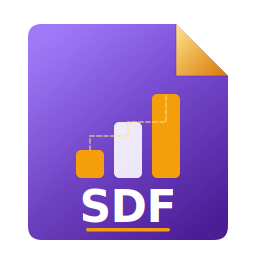
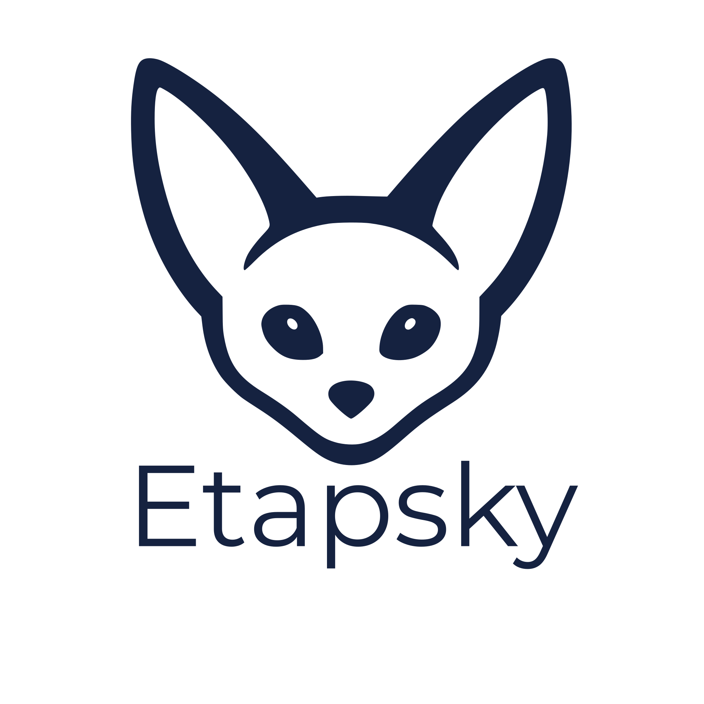

<div align="center">


<p align="center" style="margin: 1rem 0 0; font-size: 1.4rem; font-weight: 600; letter-spacing: -0.02em; line-height: 1.35;">
  
  <span style="vertical-align: middle;">— Smart Document Workstation</span>
</p>

**Native desktop client for [SDF (Smart Document Format)](https://github.com/etapsky/sdf)** — create, open, validate, and sync structured documents with **Etapsky Cloud**.

[](https://tauri.app/)
[](https://react.dev/)
[](https://www.typescriptlang.org/)
[](./LICENSE)

*macOS · Windows*

</div>

---

## Product name

The shipping application name is **Etapsky**. This repository (`sdf-desktop`) is the **workstation** codebase: a single native app for reading and producing `.sdf` files, cloud sync, and tenant-aware usage — aligned with the [Etapsky](https://etapsky.com) product line.

---

## Highlights

| Area | What you get |
|------|----------------|
| **Reader** | Open `.sdf` / PDF payloads, structured **data tree**, metadata, schema-aware panels, **PDF preview** (in-app). |
| **Trust** | **Signature status** (valid / invalid / unsigned) via Tauri validator hook; offline-friendly reading. |
| **Producer** | Guided **document generation** from built-in schemas (invoice, purchase order, nominations, government forms, etc.), save as `.sdf`. |
| **Workspace** | **Tabbed** open documents, **recent files** (persisted), **dashboard** with local + cloud-oriented KPIs. |
| **Cloud** | **Sign-in**, tenant **document list**, **upload / download / delete**, **billing usage** & quotas, **server-wins** conflict policy (MVP). |
| **Identity** | **Email + password**, **access/refresh tokens** stored in the **OS keychain** (not in web storage). |
| **Updates** | **Signed** in-app updates (`tauri-plugin-updater`), **GitHub Releases** channel, optional check on launch + **manual “Check now”** in Settings. |
| **UX** | **Command palette**, **themes** (system / light / dark), **EN / DE / FR**, toasts & error boundary, **network** hint in header. |
| **OS integration** | **`.sdf` file association**, **single-instance** app, **macOS** “Open With” / Finder open path (`RunEvent::Opened`), argv launch. |

---

## Feature detail (current)

### Core workstation

- **Dashboard** — Greeting, local recent-file stats, weekly open count, cloud usage summary when signed in, **usage chart** (tenant document volume & upload storage from billing API), **cloud library** shortcut, **recent files** table with open actions.
- **Documents** — Browse and open local **recent** paths; integrates with `documentStore`.
- **Reader** — Multi-panel layout: PDF preview, JSON/raw views where applicable, resizable splitters, download PDF/SDF where supported.
- **Producer** — React Hook Form + Zod per schema; generate and save new `.sdf` files; hooks into recent list after save.
- **Settings** — Locale, account summary, API host display, **billing** section (plan/usage when authenticated), **app version** (`getVersion`), **update check** control, about / license / docs link.

### Authentication & API

- **Register / login / logout**, **token refresh** on `401`, session via **`useAuth`**.
- **HTTP client** with Bearer injection; errors surfaced for cloud operations.
- **Configurable API base** (e.g. `VITE_API_BASE_URL`) for staging vs production.

### Cloud sync

- Paginated **cloud document list**, **upload** (`.sdf`), **download** to disk, **delete** with confirmation.
- **Usage meters** from `GET /v1/billing/usage` (documents, storage, API quota where applicable).
- **React Query** caching, invalidation, and **offline-first** behaviour for last-known data (MVP).

### Updates & release

- **Minisign**-verified updates; **public key** embedded in `src-tauri/tauri.conf.json`; **private key** only in CI secrets (`TAURI_SIGNING_PRIVATE_KEY`).
- **GitHub Actions** workflow (`.github/workflows/release-desktop.yml`) for **macOS** and **Windows** release builds and draft releases.
- **Windows** installer uses **passive** install mode for smoother enterprise rollout.

### Platform & packaging

- **Tauri 2** native shell, small footprint vs Electron-class stacks.
- **Bundled** file-type icons for `.sdf` (see [App vs document icons](#app-vs-document-icons) below).

### Not in scope yet (roadmap)

- **SSO / OIDC + PKCE** (planned after auto-updater stabilisation).
- **Full cryptographic signing pipeline** in-app (beyond current MVP hooks).
- **Enterprise MDM / policy** features — see organisation roadmap.

---

## Requirements

| Tool | Notes |
|------|--------|
| **Node.js** | LTS (e.g. 22.x) |
| **pnpm** | v9+ recommended |
| **Rust** | Stable toolchain (`rustup`) |
| **macOS** | Xcode CLT for native build |
| **Windows** | MSVC + WebView2 |

---

## Quick start

```bash
pnpm install
pnpm tauri dev
```

Production-like UI only (no Tauri shell):

```bash
pnpm dev
```

Typecheck / lint:

```bash
pnpm exec tsc --noEmit
pnpm lint
```

Release builds (local):

```bash
pnpm tauri build
```

Set `TAURI_SIGNING_PRIVATE_KEY` (and optional password) in the environment when producing **signed updater artifacts**.

---

## Repository layout (abbrev.)

```
src/
  components/     # UI: layout, reader, command palette, updater, …
  views/          # Dashboard, Document, Documents, Producer, Auth, Settings, Cloud
  hooks/          # useAuth, useSdfOpenListener, …
  lib/            # API client, Tauri wrappers, updater helpers
  stores/         # document, auth, theme, locale
  i18n/           # en-US, de-DE, fr-FR
src-tauri/        # Rust: commands, keychain, validator, bundle config
```

---

## Configuration

| Variable | Purpose |
|----------|---------|
| `VITE_API_BASE_URL` | Etapsky Cloud API origin (default production URL can be overridden for dev/staging). |

---

## App vs document icons

| Asset | Role |
|--------|------|
| [`assets/fennec-fox-app-icon.svg`](assets/fennec-fox-app-icon.svg) | **Application** icon → `pnpm icons` → `src-tauri/icons/*` |
| [`src/assets/sdf_icon.svg`](src/assets/sdf_icon.svg) (also `assets/sdf_icon.svg`) | **`.sdf` document** type → `SDFDocument.icns` / `SDFDocument.ico` via `tauri.conf.json` `bundle.resources` |

Regenerate from SVG after brand tweaks:

```bash
pnpm icons
```

**macOS:** `Info.plist` / exported UTI helps Finder show the document icon when the type is registered.  
**Windows:** Installer registry defines association; ICO is bundled for the package.

---

## Security notes

- **Tokens** are stored via the **Tauri keychain** plugin, not `localStorage`.
- **Updates** are **signature-verified** before install.
- For production releases, use **code signing** (Apple notarization, Windows Authenticate) in CI — placeholders exist in the release workflow for your org’s certificates.

---

## License

**BUSL-1.1** — Business Source License 1.1.

Non-production use is free. Commercial use requires a license from the author until the **Change Date** (**2030-03-17**), after which the license converts to **Apache License 2.0**. See [`LICENSE`](./LICENSE) and [BUSL FAQ](https://mariadb.com/bsl-faq-adopting/).

---

## Author

<div align="center">


<h3>Yunus YILDIZ</h3>

<p>Creator of <a href="https://github.com/etapsky/sdf"> SDF</a> · <strong>Etapsky Smart Document Workstation</strong> · Full Stack Developer</p>

<p><a href="https://etapsky.com"></a> <a href="https://etapsky.com">etapsky.com</a></p>

<p><em>Always learning. Always building.</em></p>

<p>Transforming ideas into digital experiences.<br/>Passionate about solving real-world challenges through technology.</p>

<p>
<a href="https://github.com/yunusyildiz-dev"></a>
<a href="https://www.linkedin.com/in/yunusyildiz-dev"></a>
<a href="https://mastodon.social/@yunusyildiz_dev"></a>
<a href="https://bsky.app/profile/yunusyildiz.dev"></a>
</p>

<p>
<a href="https://www.npmjs.com/~yunusyildiz"></a>
<a href="https://pypi.org/user/yunusyildiz/"></a>
<a href="https://yunusyildiz.dev"></a>
<a href="mailto:mail@yunusyildiz.dev"></a>
<a href="https://github.com/etapsky"></a>
</p>

<p><sub>Built with ☕ and ❤️ · Geneva, Switzerland · March 2026</sub></p>

</div>

---

<p align="center">
  <a href="https://etapsky.com">Etapsky Inc.</a> · Smart Document Workstation · <a href="https://github.com/etapsky/sdf">SDF</a>
</p>
